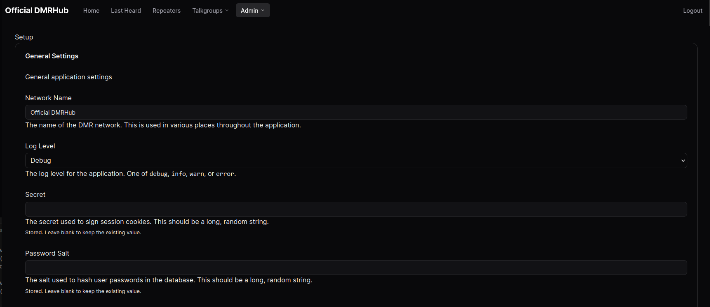

# DMRHub

       

Run a DMR network (like TGIF or BrandMeister) server with a single binary compatible with MMDVM. Includes private and group calls and a Parrot. Perfect for quick deployments in emergency situations. Intended for use with AREDN. 9990 Parrot and 4000 Unlink are implemented

## Quick links

- [FAQ](doc/FAQ.md)
- [Deployment Guide](doc/Deployment-Guide.md)
- [Configuration](doc/Configuration.md)
- [Admin's Guide](doc/Admin-Guide.md)
- [User's Guide](doc/User-Guide.md)
- [Building from Source](doc/Building.md)

## Live Server

<https://dmrhub.net> is running the "canonical" version of DMRHub. Feel free to request an account!

## Screenshots

  
More? Click to expand

