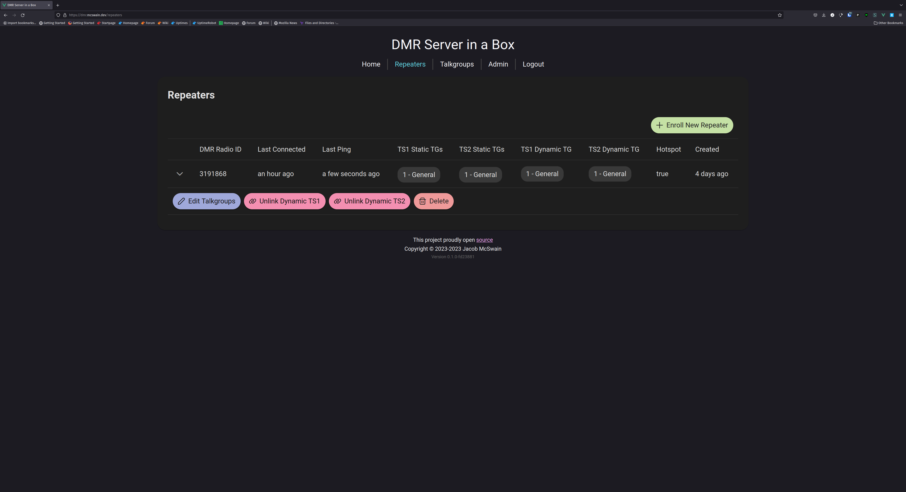

# DMRHub

       

Run a DMR network (like TGIF or BrandMeister) server with a single binary compatible with MMDVM. Includes private and group calls and a Parrot. Perfect for quick deployments in emergency situations. Intended for use with AREDN. 9990 Parrot and 4000 Unlink are implemented

## Quick links

- [FAQs](https://github.com/USA-RedDragon/DMRHub/wiki/FAQ)
- [Deployment Guide](https://github.com/USA-RedDragon/DMRHub/wiki/Deployment-Guide)
- [Admin's Guide](https://github.com/USA-RedDragon/DMRHub/wiki/Admin's-Guide)
- [User's Guide](https://github.com/USA-RedDragon/DMRHub/wiki/User's-Guide)

## Screenshots

  
More? Click to expand

## TODOs

### Soon

- Make talker alias do something
- details page for talkgroup with lastheard
- details page for repeater with lastheard
- details page for user with lastheard and repeaters
- users should be able to edit their name and callsign
- Fix MSTCL on master shutdown (signal trap)
- Hoseline equivalent

### Long Term

- Implement API tests
- Implement UDP server tests

## To test

- DMR sms and data packets

## Feature ideas

- Setting to use any free slot if possible. (i.e. timeslot routing where both slots are maximally active)
- Admin panels
  - see users where callsign and DMR ID don't match (due to dmr id db drift)
- server allowlist
- server blocklist
- ability to lock down traffic on one timeslot to a list of designated users. Intended for ensuring a timeslot remains open for emergency use)
- channel allowlist (maybe useful?)
- channel blocklist (this seems rife for abuse in some communities. maybe make this configurable by server admin?)
- add the ability for a talkgroup owner to create nets
- add the ability for talkgroup owner or net control operator to start/stop a net check-in
- add the ability for talkgroup owner or net control operator to see and export a check-in list (just query calls DB for TG=tg_id during net check-in period)
- distributed database? Maybe OLSR can help with the "where do I point my pi-star" problem that isn't a SPOF?
