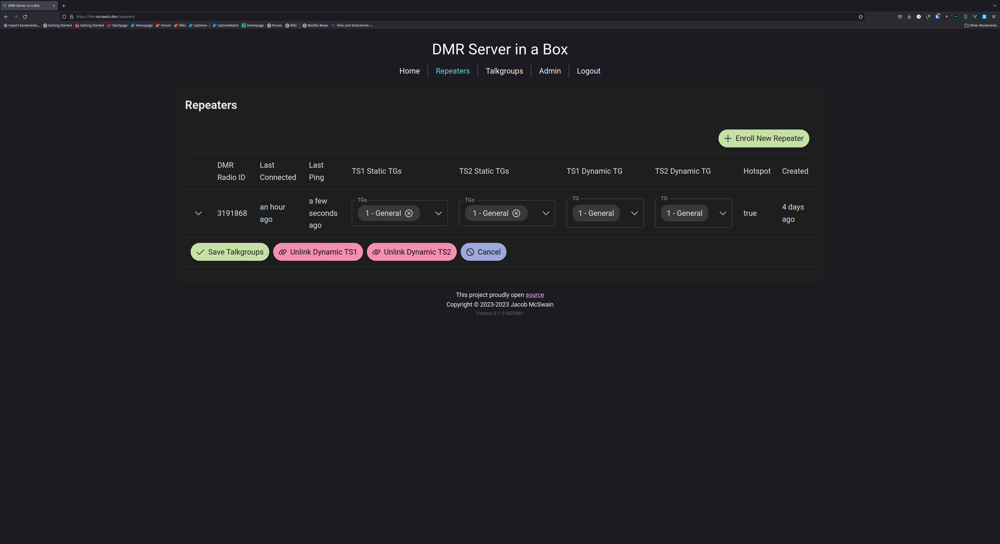

# DMR Server in a box

Run a DMR network server with a single binary. Includes private and group calls and a Parrot. Perfect for quick deployments in emergency situations. Intended for use with AREDN.

## Current Status

This project is deployed in the Oklahoma AREDN mesh. Future revisions will help clean it up and separate concerns a bit better. Everything is functional so far (excluding potential bugs) but some of the web interface needs polishing. 9990 Parrot and 4000 Unlink are implemented.

## External requirements

Redis and PostgreSQL are required.

## Screenshots


<details>
  <summary>More? Click to expand</summary>





</details>

## Deploying

### Setting up a database

TODO: Add instructions and provide a production-ready Docker-Compose file.

Once a database is made available, run the following commands in `psql` to create a database and user for this service.

```sql
CREATE USER dmr WITH ENCRYPTED PASSWORD 'changeme';
ALTER USER dmr WITH PASSWORD 'new_password';
CREATE DATABASE "dmr";
ALTER DATABASE dmr OWNER TO dmr;
GRANT ALL PRIVILEGES ON DATABASE dmr TO dmr;
\c dmr
GRANT ALL ON schema public TO dmr;
```

## Environment Variables

|            Name            |                          Default                          |                                                                                                              Description                                                                                                               |
| -------------------------- | --------------------------------------------------------- | -------------------------------------------------------------------------------------------------------------------------------------------------------------------------------------------------------------------------------------- |
| `LISTEN_ADDR`              | `0.0.0.0`                                                 | The address to listen on. `0.0.0.0` means all IPv4 addresses                                                                                                                                                                           |
| `DMR_PORT`                 | `62031`                                                   | The port to run the DMR server on                                                                                                                                                                                                      |
| `HTTP_PORT`                | `3005`                                                    | The port to run the HTTP API, Websocket, and frontend from                                                                                                                                                                             |
| `REDIS_HOST`               | `localhost:6379`                                          | The Redis connection URL. Include the port                                                                                                                                                                                             |
| `PG_HOST`                  | `localhost`                                               | The PostgreSQL server hostname                                                                                                                                                                                                         |
| `PG_PORT`                  | `5432`                                                    | The PostgreSQL server port                                                                                                                                                                                                             |
| `PG_USER`                  | `postgres`                                                | The PostgreSQL user to authenticate as                                                                                                                                                                                                 |
| `PG_PASSWORD`              | `password`                                                | The password of the PostgreSQL user                                                                                                                                                                                                    |
| `PG_DATABASE`              | `postgres`                                                | The PostgreSQL database to use                                                                                                                                                                                                         |
| `SECRET`                   | `secret`                                                  | The session encryption secret. Recommended to generate a 15+ character random password different from the `PASSWORD_SALT`.                                                                                                             |
| `PASSWORD_SALT`            | `salt`                                                    | The password [salt](https://en.wikipedia.org/wiki/Salt_(cryptography)). Recommended to generate a 15+ character random password different from the `SECRET`.                                                                           |
| `VERBOSE`                  | not set                                                   | Set to anything to enable verbose logging. Be careful as this is a LOT of logs                                                                                                                                                         |
| `CORS_HOSTS`               | `http://localhost:$HTTP_PORT,http://127.0.0.1:$HTTP_PORT` | Set to a comma-separated list of URLs you expect the app to be accessed at, including the protocol and the port if not 80/443. Used for [CORS](https://developer.mozilla.org/en-US/docs/Web/HTTP/CORS) and websocket Origin validation |
| `HIBP_API_KEY`             | not set                                                   | Set to a [HIBP](https://haveibeenpwned.com) API key to keep bad passwords away                                                                                                                                                         |
| `OTLP_ENDPOINT`            | not set                                                   | Set to an OTLP (OpenTracing) endpoint for instrumentation and tracing                                                                                                                                                                  |
| `INIT_ADMIN_USER_PASSWORD` | not set                                                   | If set on the first startup, this seeds the database with the password for the initial Admin user                                                                                                                                      |

## Todos

### Before first release

#### Things the user sees

- [API done] Make user admins appointable and implement user suspend in the UI
- [API done] Add ability to add and remove talkgroup admins and NCOs in the UI
- Finalize color scheme

#### Things the dev sees

- CI build and release
- Dockerize
- redis auth
- Document deployment
- Paginate APIs
- Rework frontend to not carry around so many objects
- componentize the frontend

### Soon

- details page for talkgroup with lastheard
- details page for repeater with lastheard
- details page for user with lastheard and repeaters
- users should be able to edit their name and callsign
- error handling needs to be double checked
- Fix MSTCL on master shutdown (signal trap)
- Hoseline equivalent
- distributed database? Maybe OLSR can help with the "where do I point my pi-star" problem that isn't a SPOF?

### Long Term

- Implement API tests
- Implement UDP server tests

## To test

- DMR sms and data packets

## Feature ideas

- Setting to use any free slot if possible. (i.e. timeslot routing where both slots are maximally active)
- Admin panels
  - see users where callsign and DMR ID don't match (due to dmr id db drift)
  - server configuration. Basically everything you'd see in env vars
- server allowlist
- server blocklist
- ability to lock down traffic on one timeslot to a list of designated users. Intended for ensuring a timeslot remains open for emergency use)
- channel allowlist (maybe useful?)
- channel blocklist (this seems rife for abuse in some communities. maybe make this configurable by server admin?)
- add the ability for a talkgroup owner to create nets
- add the ability for talkgroup owner or net control operator to start/stop a net check-in
- add the ability for talkgroup owner or net control operator to see and export a check-in list (just query calls DB for TG=tg_id during net check-in period)
