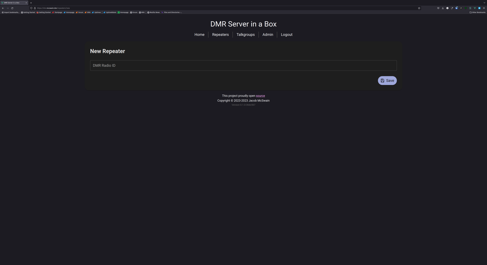

# DMR Server in a box

Run a DMR network server with a single binary. Includes private and group calls and a Parrot. Perfect for quick deployments in emergency situations. Intended for use with AREDN.

## Current Status

This project is deployed in the Oklahoma AREDN mesh. Future revisions will help clean it up and separate concerns a bit better. Everything is functional so far (excluding potential bugs) but some of the web interface needs finishing. 9990 Parrot and 4000 Unlink are implemented.

## External requirements

Right now, Redis is the only requirement, though the database will be externalized in the future.

## Screenshots

## Todos

### Before first release

#### Things the user sees

- Make user admins appointable and implement user suspend in the UI
- Add ability to add and remove talkgroup admins in the UI
- Superadmin class that can add and remove admin
- Admin class that can make and delete talkgroups, suspend and enable users, appoint and demote talkgroup owners, and see the master repeater and user list
- Finalize color scheme

#### Things the dev sees

- CI build and release
- database configurable either postgres or sqlite
- Dockerize
- flags to env vars
- make cors hosts configurable
- redis auth
- Document deployment
- Paginate APIs
- Rework frontend to not carry around so many objects
- componentize the frontend
- seed an initial user + dummy parrot user

### Soon

- details page for talkgroup with lastheard
- details page for repeater with lastheard
- details page for user with lastheard and repeaters
- users should be able to edit their name and callsign
- error handling needs to be double checked
- Fix MSTCL on master shutdown (signal trap)
- distributed database? Maybe OLSR can help with the "where do I point my pi-star" problem that isn't a SPOF?

### Long Term

- Implement API tests
- Implement UDP server tests
- metrics

## To test

- DMR sms

## Feature ideas

- Setting to use any free slot if possible. (i.e. timeslot routing where both slots are maximally active)
- Admin panels
  - see users where callsign and DMR ID don't match (due to dmr id db drift)
  - server configuration. Basically everything you'd see in env vars
- server allowlist
- server blocklist
- ability to lock down traffic on one timeslot to a list of designated users. Intended for ensuring a timeslot remains open for emergency use)
- channel allowlist (maybe useful?)
- channel blocklist (this seems rife for abuse in some communities. maybe make this configurable by server admin?)
